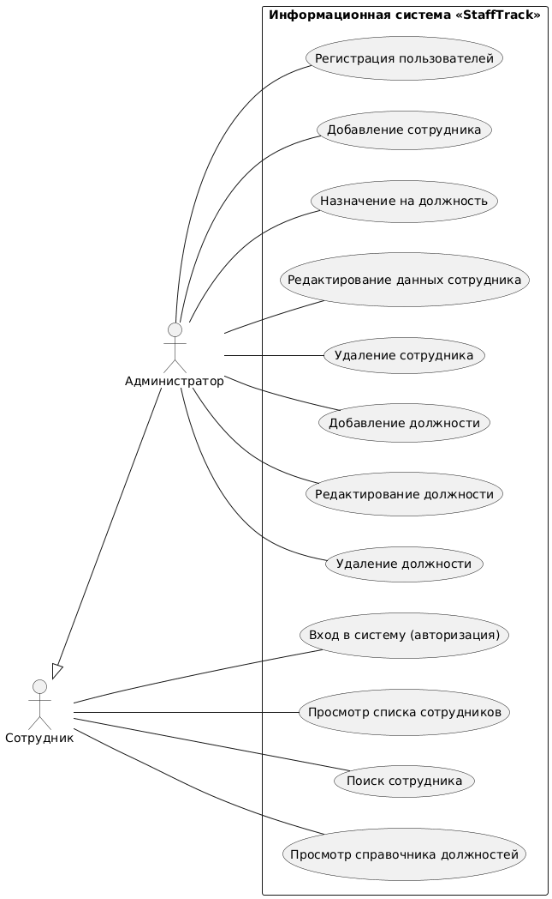

# Информационная система учёта сотрудников и должностей «StaffTrack»

<p align="center">
  
  
  
  
</p>

---

> **StaffTrack** — программный комплекс, предназначенный для централизованного учёта персонала, контроля соответствия работников занимаемым должностям, ведения организационно-штатной структуры и поддержания целостности кадровой информации предприятия.

Проект разрабатывается в рамках дисциплины **«Информатика»** на кафедре *«Вычислительные системы и технологии»* (ИРИТ, НГТУ им. Р.Е. Алексеева).

---

## 📋 Оглавление
- [Информационная система учёта сотрудников и должностей «StaffTrack»](#информационная-система-учёта-сотрудников-и-должностей-stafftrack)
  - [📋 Оглавление](#-оглавление)
  - [🎯 Цель и задачи проекта](#-цель-и-задачи-проекта)
    - [Ключевые задачи системы:](#ключевые-задачи-системы)
  - [👥 Роли пользователей и матрица доступа](#-роли-пользователей-и-матрица-доступа)
  - [⚙️ Функциональные возможности](#️-функциональные-возможности)
  - [🏗 Архитектура системы](#-архитектура-системы)
  - [📊 Моделирование процессов](#-моделирование-процессов)
    - [Диаграмма прецедентов (Use Case)](#диаграмма-прецедентов-use-case)
    - [Ключевые алгоритмы работы:](#ключевые-алгоритмы-работы)
  - [📁 Структура репозитория](#-структура-репозитория)
  - [🚀 Установка и запуск](#-установка-и-запуск)
    - [Системные требования](#системные-требования)
    - [Инструкция по развёртыванию](#инструкция-по-развёртыванию)
  - [👨‍💻 Сведения об авторе](#-сведения-об-авторе)

---

## 🎯 Цель и задачи проекта

**Цель разработки:** создание программного комплекса для автоматизации процессов учёта сотрудников и структуры должностей организации в едином информационном пространстве.

### Ключевые задачи системы:
* **Кадровый учёт:** безопасное хранение персональных данных работников, информации об их статусе (активен, в отпуске, уволен) и текущей позиции.
* **Ведение справочника должностей:** формирование актуального каталога штатных должностей с фиксацией окладов и квалификационных требований.
* **Связывание сущностей и перемещения:** закрепление должностей за сотрудниками с возможностью последующего служебного перевода или снятия с должности.
* **Многокритериальный поиск:** предоставление инструментов гибкой выборки персонала по связке атрибутов (*ФИО*, *должность*, *статус*, *подразделение*).
* **Контроль целостности:** разграничение прав доступа и валидация данных перед совершением операций удаления или изменения.

---

## 👥 Роли пользователей и матрица доступа

В системе реализована ролевая модель доступа (**RBAC**), разделяющая полномочия на два уровня:

| Роль | Права | Описание и доступные функции |
| :--- | :---: | :--- |
| **Администратор** *(Специалист по кадрам)* | **RW** *(Полный доступ)* | Регистрация учётных записей пользователей, создание/удаление карточек сотрудников, редактирование штатного расписания и окладов, оформление переводов и увольнений. |
| **Сотрудник** *(Пользователь системы)* | **RO** *(Только чтение)* | Персональная авторизация, просмотр справочника должностей организации, поиск коллег по базе данных без возможности внесения правок. |

---

## ⚙️ Функциональные возможности

Комплекс функций системы сгруппирован по бизнес-модулям:

1. **Кадровый учёт сотрудников:**
   * Регистрация нового работника с заполнением электронной карточки (ФИО, телефон, должность);
   * Редактирование реквизитов и актуализация сведений;
   * Снятие сотрудника с учёта (увольнение с архивацией записи).
2. **Управление каталогом должностей:**
   * Добавление новых должностных единиц в штатное расписание;
   * Установка и индексация должностных окладов;
   * Безопасное удаление позиций с проверкой ограничений внешних ключей.
3. **Назначения и перемещения:**
   * Первичное закрепление специалиста за вакантной позицией;
   * Перевод работника на новую должность с автообновлением связей в БД.
4. **Поиск и фильтрация:**
   * Поиск по подстроке ФИО, фильтрация списков по статусу и окладу.

---

## 🏗 Архитектура системы

Программный комплекс строится по принципам классической **трёхуровневой архитектуры** (*3-Tier Architecture*):

```
┌────────────────────────────────────────────────────────┐
│         Слой представления (Presentation Layer)        │
│       Консольный / Графический интерфейс, валидация    │
└───────────────────────────┬────────────────────────────┘
                            │ (DTO / Команды)
┌───────────────────────────▼────────────────────────────┐
│          Слой бизнес-логики (Business Logic Layer)     │
│   Ядро системы, ролевой контроль, проверка ограничений │
└───────────────────────────┬────────────────────────────┘
                            │ (CRUD / Запросы)
┌───────────────────────────▼────────────────────────────┐
│                Слой данных (Data Layer)                │
│    DAO / Репозиторий доступа ───► Реляционная БД       │
└────────────────────────────────────────────────────────┘
```

* **Слой представления:** взаимодействие с пользователем через CLI/GUI, сбор входных данных и вывод системных уведомлений.
* **Слой бизнес-логики:** валидация входных форматов, проверка уникальности идентификаторов, контроль невозможности назначить сотрудника на несуществующую должность.
* **Слой данных:** уровень хранения и персистентности, гарантирующий ACID-свойства транзакций и реляционную целостность.

---

## 📊 Моделирование процессов

### Диаграмма прецедентов (Use Case)
Отражает сценарии взаимодействия пользователей с системой «StaffTrack»:

<p align="center">
  
</p>

> Исходный декларативный код диаграммы сохранён в формате PlantUML: [`docs/diagrams/usecase.puml`](docs/diagrams/usecase.puml).

### Ключевые алгоритмы работы:
* **Алгоритм добавления сотрудника:** включает проверку роли текущего пользователя (`Администратор`), верификацию формата вводимых данных, проверку наличия выбранной должности в справочнике и атомарную запись в базу данных.
* **Алгоритм перевода на должность:** производит поиск сотрудника и новой позиции в БД, проверяет, не занимает ли работник данную должность в текущий момент, после чего перезаписывает идентификатор связи.

---

## 📁 Структура репозитория

```text
stafftrack/
├── .gitignore               # Исключения системных и временных файлов
├── README.md                # Главный документ проекта (документация)
├── docs/                    # Проектная документация
│   └── diagrams/            # Исходники и рендеры диаграмм
│       ├── usecase.puml     # Use Case код на языке PlantUML
│       └── usecase.png      # Сгенерированное растровое изображение
├── src/                     # Исходный программный код
│   └── main.py              # Точка входа в приложение (прототип)
└── tests/                   # Модульные и интеграционные тесты
```

---

## 🚀 Установка и запуск

### Системные требования
* **Интерпретатор / Компилятор:** Python 3.10+ 
* **Система контроля версий:** Git 2.40+

### Инструкция по развёртыванию

1. **Клонировать репозиторий на локальную машину:**
   ```bash
   https://github.com/RADiant-Git/StuffTrack.git
   cd StuffTrack
   ```

2. **Запустить исходную версию программы:**
   ```bash
   python src/main.py
   ```

---

## 👨‍💻 Сведения об авторе

* **Выполнил:** студент Русанов А. Д.
* **Учебная группа:** 26-ИВТ-4-1
* **ВУЗ:** НГТУ им. Р.Е. Алексеева (Нижний Новгород)
* **Институт:** ИРИТ
* **Дисциплина:** Информатика
* **Проверил:** ассистент Китов А. А.
* **Год выполнения:** 2026